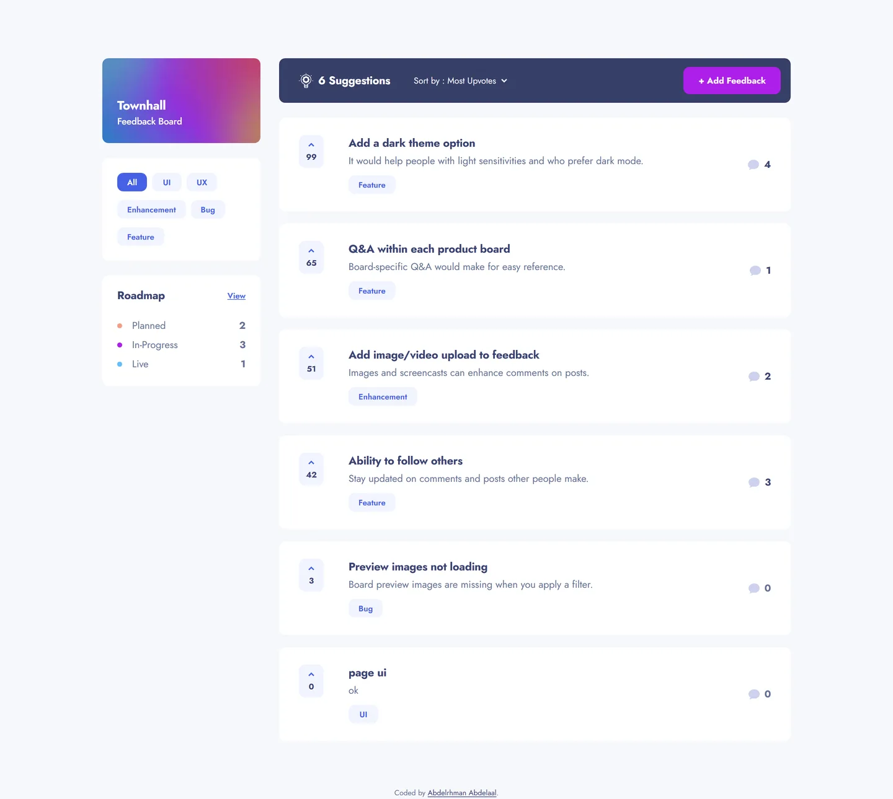

# Product feedback app

My solution to the [Product feedback app](https://www.frontendmentor.io/challenges/product-feedback-app-wbvUYqjR6)
challenge on Frontend Mentor.

- Live: https://product-feedback-app.abdelrhman-ahmed8881.workers.dev
- Code: https://github.com/MrBlackvanta/product-feedback-app

## Built with

- Next.js
- React
- TypeScript
- Tailwind CSS
- Vitest
- Testing Library
- .NET
- xUnit
- PostgreSQL

## Author

- [LinkedIn](https://www.linkedin.com/in/abdelrhman-vanta/)
- [UpWork](https://www.upwork.com/freelancers/mrblackvanta)
- [Frontend Mentor](https://www.frontendmentor.io/profile/MrBlackvanta)
